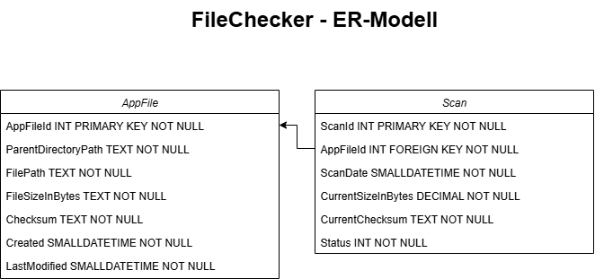

# FileChecker - Technische Dokumentation

## Kurzbeschreibung
 Der Benutzer soll in der Lage sein, eine Menge von Dateien zu verwalten und Änderungen innerhalb der Dateien mittels eines kryptografischen Hashs zu erkennen. Das Programm soll aus einer Benutzeroberfläche bestehen, die es dem Benutzer ermöglicht,  
 - alle Dateien und deren Informationen aufzulisten,  
 - neue Dateien hinzuzufügen oder zu entfernen,  
 - den Dateigrößen-Verlauf pro Scan anzuzeigen,  
 - einen vollständigen oder teilweisen Scan zu starten.  

## Technische Entscheidung
### Visual Studio
- .NET 8.0
- C#
- WinForms
- MSSQL Server
- EntityFrameworkCore

## Einschränkungen
Da es sich hierbei um eine WinForms-Anwendung handelt, kann dieses Programm **ausschließlich auf einem Windows Betriebssystem** ausgeführt werden. Diese Entscheidung wurde bewusst getroffen, um den Prototypen innerhalb der streng befristeten Zeit von 8 Stunden zu vereinfachen. Sollte sich der Kunde in der Zukunft ein plattformunabhängiges Programm wünschen, müssen dementsprechend Entscheidungen getroffen werden.  

## Programm
### Aufbau und Architektur
#### Projektreferenzen
| Projektname | Typ | Funktion | Referenz |
| -- | -- | -- | -- |
| FileChecker.Forms | Windows Forms App | Grafisches User-Interface | FileChecker.Core |
| FileChecker.Core | Klassenbibliothek | Business-Logik | FileChecker.Data |
| FileChecker.Data | Klassenbibliothek | Datenbank-Entitäten, AccessLayer, Migrationen | / |   

####  Installierte NuGet Pakete
| Name  | Version | Lizenz |
| -- | -- | -- |
| Microsoft.EntityFrameworkCore | 9.0.8 | MIT |
| Microsoft.EntityFrameworkCore.Design |  9.0.8 | MIT |
| Microsoft.EntityFrameworkCore.SqlServer | 9.0.8 | MIT |
| Microsoft.EntityFrameworkCore.Tools | 9.0.8 | MIT |

## Datenbank
In diesem Programm handelt es sich um eine lokale SQL Datenbank. Hierfür wird der bereits im Visual Studio integrierte SQL Server verwendet.

Damit der Prototyp auch auf Ihrem Rechner läuft, müssen Sie:
1. Den **ConnectionString** im ``FileChecker.Data/FileCheckerDbContext`` anpassen
2. [Die Daten korrekt migrieren](#migration)

### Migration
1. Öffnen Sie die ``Package Manager Console``
2. Wählen Sie als Default-Projekt ``FileChecker.Data`` aus
3. Geben Sie in der Konsole jeweils folgende Befehle ein und bestätigen Sie mit Enter:
- ``Add-Migration InitialCreate``
- ``Update-Database``

Wenn Sie diese Schritte richtig ausgeführt haben, werden Sie im **FileChecker.Data** einen ``Migrations``-Ordner sehen!

### ER-Diagramm
Das Datenbank besteht aus zwei Tabellen (Relationen). Die Relationen befinden sich in dritter Normalform. Die Beziehung zwischen den Relationen ist 1:1. Ein File kan mehrere Scans haben. Ein Scan gehört zu nur einem File.

#### Relation AppFile
Diese Relation wurde **nicht** "File" genannt, weil das Wort "File" auf Programmierebene ein reserviertes Schlüsselwort mit ihren eigenen Funktionen und Feldern ist. Um diesbezügliche Komplikationen zu vermeiden, wurde die Relation "AppFile" genannt.

- AppFileId => Primärschlüssel
- ParentDirectoryPath => Der absolute Pfad vom Ordner, in der sich das aktuelle File befindet
- FilePath => Der absolute Pfad des Files
- FileSizeInBytes => Größe des Files in Bytes
- Checksum => Prüfsumme des File-Inhalts
- Created => Erstellungsdatum des Files inklusive Uhrzeit
- LastModified => Letztes Änderungsdatum inklusive Uhrzeit

#### Relation Scan
- ScanId => Primärschlüssel
- AppFileId => Fremdschlüssel, Id des Files, auf die sich der Scan bezieht
- ScanDate => Datum des Scans inklusive Uhrzeit
- CurrentSizeInBytes => Aktuelle File-Größe in Bytes
- CurrentCheksum => Aktuelle Prüfsumme des File-Inhalts
- Status => Zwei Optionen: NoChanges, FileChanged

## Programm Dos und Don'ts
### Dos
 - Alle Dateien und deren Informationen werden aufgelistet.
 - Neue Dateien können hinzugefügt werden.
 - Die Dateigröße wird pro Scan angezeigt.
 - Ein teilweiser Scan (Scan für einzelnes Dokument) kann gestartet werden.  

### Don'ts
 - Dateien entfernen => Delete-Funktion für das Entfernen der Dateien befindet sich bereits im ``AppFileAccessLayer``, wurde jedoch noch nicht in der UI implementiert. 

 # FileChecker - User Dokumentation
 ## Starten
 Starten Sie das Programm FileChecker.

## Dateien hinzufügen
Um Dateien in die Tabelle hinzuzufügen, klicken sie ``Explorer öffnen`` im Hauptfenster.
Nun wird der File-Explorer geöffnet. Wählen Sie einen Ordner aus, deren Dateien Sie in die Tabelle hinzufügen möchten und bestätigen Sie die Eingabe. Der Pfad ihres ausgewählten Ordners wird nun Im Textfeld **"Initialer Ordner-Pfad"** angezeigt. Sie können jetzt auf ``Dateien hinzufügen`` klicken und alle Dateien und Dateien der Unterordner ihres gewählten Ordners werden in der Tabelle auf der linken Seite des Hauptfensters angezeigt.

## Datei scannen
Um eine Datei scannen zu können, markieren wählen sie Ihre gewünschte Datei aus der linken Tabelle aus und klicken Sie auf ``Datei scannen``. Die Ergebnise des Scans werden Ihnen in der Tabelle auf der rechten Seite des Hauptfensters angezeigt.

# FileChecker - Test Dokumentation

## Testskript
| Test Id | Arrange | Act | Assert |
| -- | -- | -- | -- | 
| 1 | Programm starten - Hauptansicht **Dateien** sollte angezeigt werden. | Button ``Dateien hinzufügen`` klicken | Der Button sollte deaktiviert und unklickbar sein. | 
| 2 | Programm starten - Hauptansicht **Dateien** sollte angezeigt werden. ``Explorer öffnen`` klicken und einen Ordner auswählen und bestätigen. | Button ``Dateien hinzufügen`` klicken | Der Button sollte aktiv und klickbar sein. Die Dateien aus dem ausgewählten Ordner sollten der linken Tabelle hinzugefügt werden. |

## Ausführung
| Test Id | Uhrzeit | Status | Notizen |
| -- | -- | -- | -- | 
| 1 | 9:20 | FAILED | / |
| 1 | 9:37 | SUCCESS | / |
| 2 | 10:00 | FAILED | / |
| 2 | 10:09 | SUCCESS | / |
